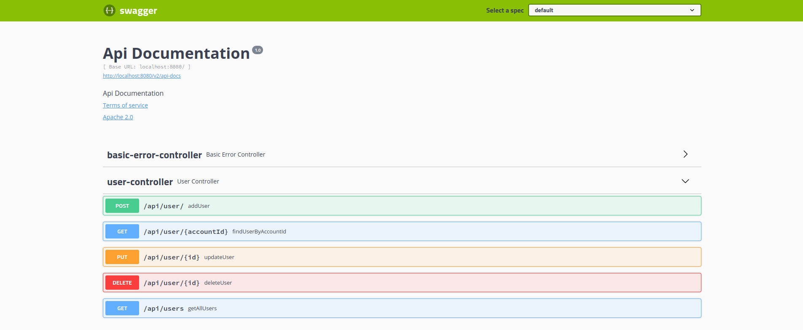

## Sprint boot Rest API

A basic crud with JPA, Hibernate & Swagger documentation support.
H2 SQL database is used for development, it can be easily replaced by another SQL database, configuration should be 
updated in application.properties. H2 console can be accessed at http://localhost:8080/h2-console 


### Deployment
```
docker build -t spring-api .
```

```
docker run -d -p 8080:8080 spring-api
```

## Swagger documentation
* Accessible at : http://localhost:8080/swagger-ui.html


<p align="center">
  
</p>

